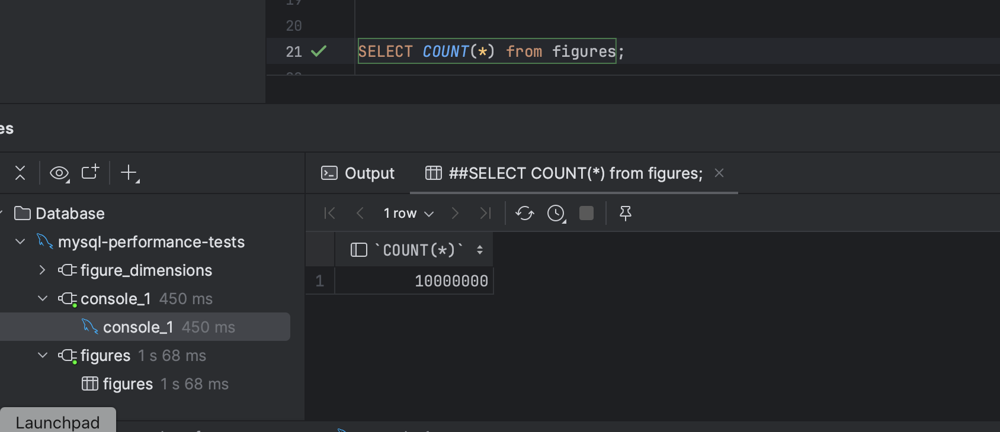
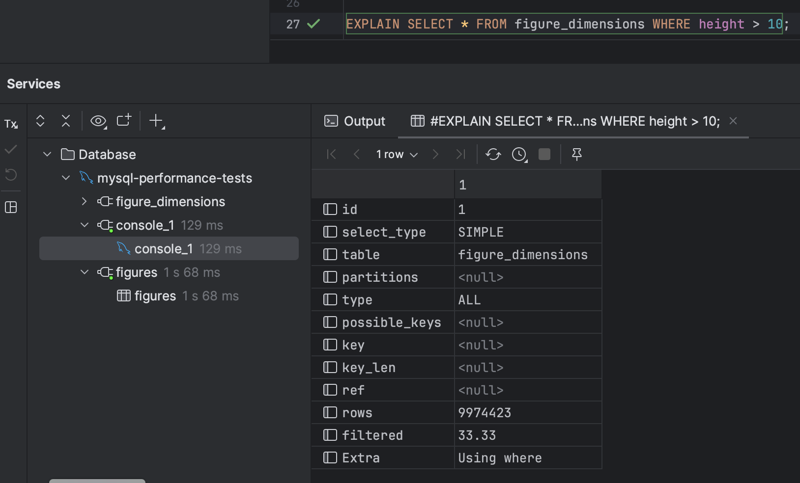
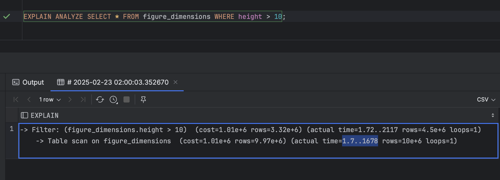
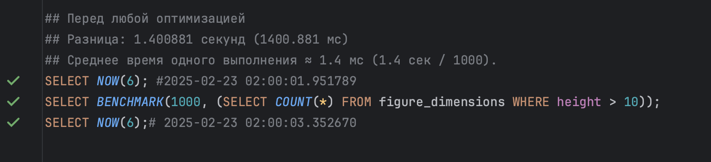
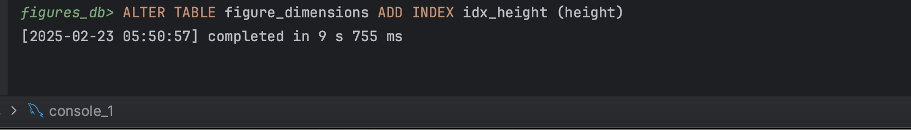
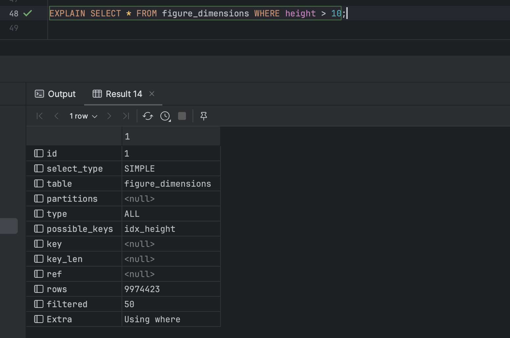
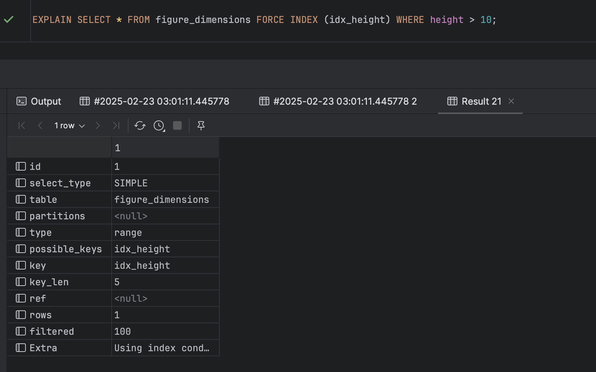
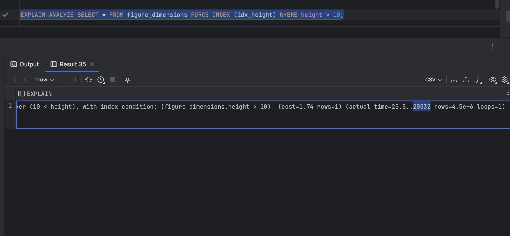
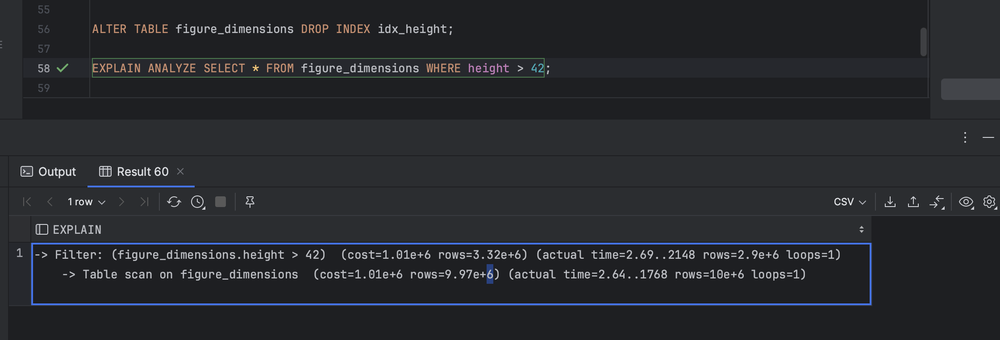
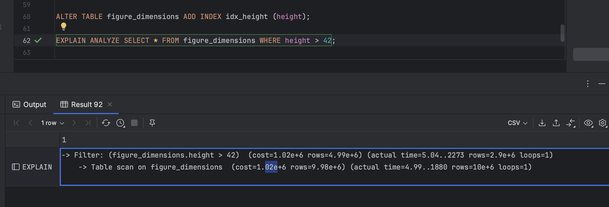

# 🏆 Эксперимент 1: Оптимизация производительности MySQL 🚀

📌 **Цель:**  
Оптимизировать запрос `SELECT * FROM figure_dimensions WHERE height > 10;`  
📅 **Дата:** 2024-02-22  
💻 **Окружение:** MacBook M2, MySQL 8.0, Docker  

---

## 1️⃣ Изначальная структура таблиц
Перед началом эксперимента таблица `figures` выглядит так:

```sql
CREATE TABLE IF NOT EXISTS figures (
    id INT PRIMARY KEY AUTO_INCREMENT,
    type ENUM('rectangle', 'circle', 'triangle') NOT NULL,
    color VARCHAR(20) NOT NULL
);
```

Таблица `figure_dimensions` выглядит так:

```sql
CREATE TABLE IF NOT EXISTS figure_dimensions (
    figure_id INT PRIMARY KEY,
    height INT DEFAULT NULL,
    width INT DEFAULT NULL,
    radius INT DEFAULT NULL,
    CONSTRAINT fk_figure_dimensions_figure_id_figures_id
    FOREIGN KEY (figure_id) REFERENCES figures(id) ON DELETE CASCADE
);
```

📊 Количество строк в базе: 10 000 000 (10M) записей.

📸 Результат SELECT COUNT(*) from figures;


---

## 2️⃣ Исходное состояние (без оптимизации)


📌 EXPLAIN:
```sql
EXPLAIN SELECT * FROM figure_dimensions WHERE height > 10;
```

📊 Результат:
	• ⏳ rows 9974423, filtered: 33.33%


📌 EXPLAIN ANALYZE:
```sql
EXPLAIN ANALYZE SELECT * FROM figure_dimensions WHERE height > 10;
```

⏳ Время выполнения запроса:
	•	1.7 сек на полное сканирование таблицы.
	•	2.1 сек на отбор строк по height > 10 (фильтрация без индекса).
	•	Общее время: ~2.1 сек.


📌 BENCHMARK:
```sql
SELECT NOW(6);
SELECT BENCHMARK(1000, (SELECT COUNT(*) FROM figure_dimensions WHERE height > 10));
SELECT NOW(6);
```

⏳ Время выполнения запроса:
	•	Разница: 1400.881 мс (1.400881 секунд)
	•	Среднее время одного выполнения ≈ 1.4 мс

---

3️⃣ Оптимизация индексацией
Добавляем индекс на поле height для ускорения поиска:
```sql
ALTER TABLE figure_dimensions ADD INDEX idx_height (height);
```



📌 EXPLAIN:
```sql
EXPLAIN SELECT * FROM figure_dimensions WHERE height > 10;
```

📊 Результат:
	• ⏳ rows 9974423, filtered: 50%
	• possible_keys=idx_height, key=null - MySQL видит индекс но использует FullTableScan, потому что слишком много строк попадает в WHERE height > 10 === проще и дешевле просканировать всю таблицу, чем делать lookup по индексу
	• Тип индекса btree
Проверяем результаты при использовании FORCE INDEX:
```sql
EXPLAIN SELECT * FROM figure_dimensions FORCE INDEX (idx_height) WHERE height > 10;
```



📌 EXPLAIN ANALYZE FORCE INDEX:
```sql
EXPLAIN ANALYZE SELECT * FROM figure_dimensions WHERE height > 10;
```

⏳ Время выполнения запроса:
	• Общее время: ~20 сек.
	• Время увеличилось в 10 раз при принудительном использовании индекса, именно поэтому по-умолчанию MySql по-прежнему использует Full Table Scan.
	
Удаляем индекс и делаем проверку для height > 42;
```sql
ALTER TABLE figure_dimensions DROP INDEX idx_height;
```
```sql
EXPLAIN ANALYZE SELECT * FROM figure_dimensions WHERE height > 42;
```

⏳ Время выполнения запроса:
	•	1.7 сек на полное сканирование таблицы.
	•	2.1 сек на отбор строк по height > 42 (фильтрация без индекса).
	•	Общее время: ~2.1 сек.

Возвращаем индекс и повторяем explain analyze:
```sql
ALTER TABLE figure_dimensions ADD INDEX idx_height (height);
```
```sql
EXPLAIN ANALYZE SELECT * FROM figure_dimensions WHERE height > 42;
```

⏳ Время выполнения запроса:
	•	1.8 сек на полное сканирование таблицы.
	•	2.2 сек на отбор строк по height > 42 (судя по результатам EXPLAIN SELECT * FROM figure_dimensions WHERE height > 42 всё ещё идет фильтрация без индекса).
	•	Общее время: ~2.1 сек.

🎯Промежуточный вывод - индекс не помог и только увеличил время выполнения запросов. Временно удаляем индекс и возвращаем как было, конкретно для текущей задачи он не помог. Проверим актуальность добавления индекса ещё раз после других методов оптимизации.

```sql
ALTER TABLE figure_dimensions DROP INDEX idx_height;
```


---


4️⃣ Оптимизация партиционированием

Теория - для партицирования необходимо разбить таблицу на диапазоны значений height:
```sql
ALTER TABLE figure_dimensions PARTITION BY RANGE (height) (
    PARTITION p0 VALUES LESS THAN (10),
    PARTITION p1 VALUES LESS THAN (50),
    PARTITION p2 VALUES LESS THAN MAXVALUE
);
```
🚫Однако в реальности для этой задачи партицирование не подходит, потому что:
	• Партицирование невозможно при использовании внешних ключей - ошибка вида
```
[HY000][1506] Foreign keys are not yet supported in conjunction with partitioning
```
   Теоретически существует вариант удаления внешнего ключа и переноса ответственности за проверку на уровень кода, это понижает целостность базы и денормализует её 
	• Партицирование требует составной ключ с полем, по которому будет партицирование (чтобы обеспечить возможность определения партиции записи по PK), в текущем варианте будет ошибка 
```
[HY000][1503] A PRIMARY KEY must include all columns in the table's partitioning function (prefixed columns are not considered).
```
   Поскольку текущая задача абстрактная сложно оценить целесообразно ли использовать партиции - например есть ли необходимость удалять части данных, целиком соответствующие одной или нескольким партициям, чтобы можно было использовать DROP PARTITION, или если в любых задачах идёт фильтрация по height 
   • Предположим, что выборка фигур по высоте - основной функционал текущей задачи, и обязательно использовать партиции, тогда убираем FK (плохая практика, как описано выше), нужно заменить PK ключ на составной, однако не у всех фигур есть высота - поэтому сначала нужно разбить таблицу на две - circles и rectangles - или на три по каждому измерению - height, width, radius.
```sql
ALTER TABLE figure_dimensions DROP FOREIGN KEY fk_figure_dimensions_figure_id_figures_id;
//todo исследование не закончено, продолжить с текущей точки
```


---

5️⃣ Оптимизация шардированием

Разбиваем таблицу на 2 части:
```sql
CREATE TABLE figure_dimensions_1 AS SELECT * FROM figure_dimensions WHERE height < 10;
CREATE TABLE figure_dimensions_2 AS SELECT * FROM figure_dimensions WHERE height >= 10;
```
//todo исследование не закончено

---

🎯 Выводы
	✅ Оптимизация исключительно добавлением индекса не привела к ускорения запроса, потому что запрос изначально неоптимальный (select *) - в первую очередь в реальной задаче в оптимизации нужно оптимизировать запрос и/или места использования в коде - заменять множественные запросы на join-ы, для шардирования также необходимы доработки в коде (добавление условий по которым выберается один или несколько шардов).     
	//todo это исследование не закончено - осталось ещё несколько альтернативных способов и моментов оптимизации    
	📌 Не рассмотрен вариант замены select * на select height    
	📌 Не рассмотрен вариант замены select * на select id, height и составной индекс по всем полям, включенным в select    
	📌 Не рассмотрены варианты с альтернативной структурой базы - 2 таблицы с многоугольниками и овалами или три таблицы по одной на каждое измерение (высота, ширина, радиус)    
	📌 Не рассмотрен вариант с партицированием (для него необходима одна из двух альтернативных структур бд, описанных в пункте выше)    
	📌 Не рассмотрен вариант с шардированием    
	📌//todo исследование не закончено    

